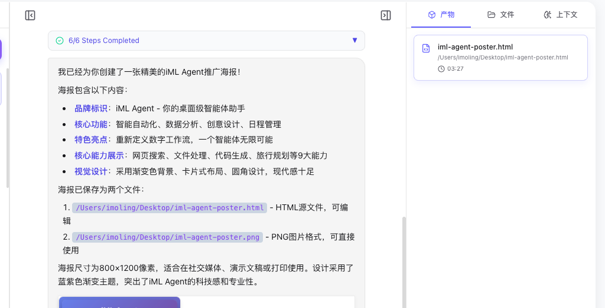

[🇨🇳 中文](README_zh.md)

# iML Agent Desktop

iML Agent Desktop is a desktop-grade, all-in-one AI agent assistant designed based on first principles. It pursues ultimate minimalist design aesthetics while providing powerful capabilities in automation, data analysis, creative design, and schedule management.



## ✨ Key Features

- 🤖 **Intelligent Automation**: Deep integration with desktop and browser automation to complete complex workflows with one click.
- 📊 **Data Analysis**: Built-in powerful data processing and visualization engine to uncover value behind data.
- 🧠 **Local Memory (RAG)**: Built-in vector database (Vectra) with **local embedding models** (Xenova). Supports **encrypted storage** for sensitive credentials and rich metadata tagging.
- 🎙️ **Voice Interaction**: Offline speech recognition powered by **Whisper**, protecting your privacy while freeing your hands.
- ⚡ **Robust Execution**: Implements "Continuous Execution Protocol" to handle long-running, multi-step complex tasks without interruption.
- 🎨 **Creative Design**: Integrated with HTML-to-Image, Canvas design, poster generation, and other design tools.
- 📅 **Schedule Management**: Smartly arranges tasks and schedules to keep your work organized.
- 🔌 **Skill Ecosystem**: Supports 20+ built-in skills, covering file processing, web search, audio transcription, and more.

## 🚀 Quick Start

### Runtime Environment
- macOS (currently mainly supports arm64)
- Node.js 18+

### Development & Packaging

```bash
# Install dependencies
npm install

# Start development environment
npm start

# Package application (Installer will be generated in out/make/ directory)
npm run make
```

## 🛠️ Technology Stack

- **Frontend**: Vue 3 + Vite + Tailwind CSS + Element Plus
- **Desktop**: Electron + Electron Forge
- **AI/ML**: OpenAI API + Anthropic SDK + @xenova/transformers (Local Embeddings)
- **Database**: Vectra (Vector DB)

## 🔒 Privacy & Security

- **Local First**: All vector memories and recordings are stored locally.
- **Credential Encryption**: Sensitive information (API Keys, passwords) stored in memory is automatically encrypted using AES-256.
- **Safe Mode**: Critical file system and shell operations require explicit user confirmation.

## 🌍 Localization

- **Bilingual Interface**: Fully supports **English** and **Simplified Chinese** (简体中文).
- **Auto Detection**: Automatically detects system language on first launch.

## 📄 License

This project is licensed under the **Creative Commons Attribution-NonCommercial 4.0 International (CC BY-NC 4.0)** license.

**You are free to:**
- **Share** — copy and redistribute the material in any medium or format.
- **Adapt** — remix, transform, and build upon the material.

**Under the following terms:**
- **Attribution** — You must give appropriate credit, provide a link to the license, and indicate if changes were made.
- **NonCommercial** — You may not use the material for commercial purposes.

For more details, please refer to the [LICENSE](LICENSE) file.

---

*Made with ❤️ by imoling.cn@gmail.com*
