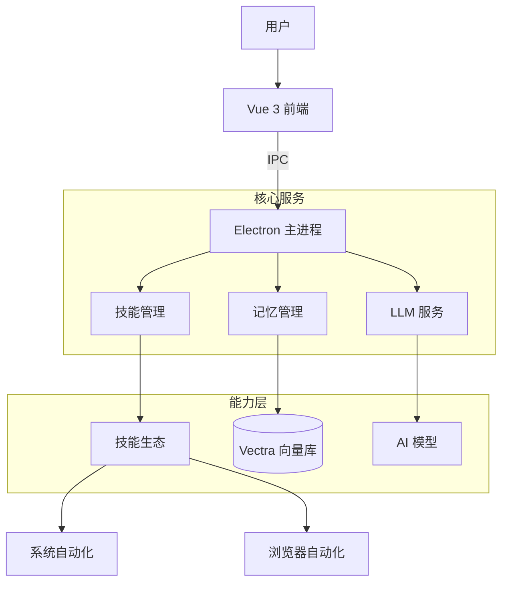

[🇺🇸 English](README.md)

# iML Agent Desktop

**iML Agent Desktop** 是一款**原生桌面级全能智能体助手**。它采用“大脑+技能”的全新架构，不仅追求极致简洁的设计美感，更具备强大的自动化执行、深度数据分析、创意设计与智能日程管理能力。


## ✨ 核心特性

- 🤖 **智能自动化**：深度集成桌面自动化和浏览器自动化，一键完成复杂工作流。
- 📊 **数据分析**：内置强大的数据处理和可视化引擎，洞察数据背后的价值。
- 🧠 **本地记忆库 (RAG)**：内置向量数据库（Vectra）与 **本地嵌入模型** (Xenova)。支持 **加密存储** 敏感凭证以及富元数据管理。
- 🎙️ **语音交互**：基于 **Whisper** 模型的离线语音识别，保护隐私的同时彻底解放双手。
- ⚡ **稳健执行**：实现 "连续执行协议" (Continuous Execution Protocol)，确保长链路复杂任务不中断。
- 🎨 **创意设计**：集成 HTML 转图片、Canvas 设计、海报生成等多种设计工具。
- 📅 **日程管理**：智能安排任务和日程，让工作更有条理。
- 🔌 **技能生态**：支持 20+ 内置技能，涵盖文件处理、网页搜索、音频转录等。

## 🚀 快速开始

> **[📦 安装说明 (v0.5.0)](INSTALL_v0.5.0_zh.md)**: 点击此处查看详细的安装与配置指南。

### 运行环境
- macOS (目前主要支持 arm64)
- Node.js 18+

### 开发与打包

```bash
# 安装依赖
npm install

# 启动开发环境
npm start

# 打包应用 (生成的安装包在 out/make/ 目录下)
npm run make
```

## 💡 技术创新点

- **原生智能体架构 (Native Agent Architecture)**: 不同于传统的“对话框+工具调用”模式，本项目赋予 LLM 完整的“大脑”权限。它能自主拆解抽象目标、规划复杂步骤、并在执行中根据反馈动态调整策略，真正实现从“被动问答”到“主动行动”的进化。
- **原生实现 (Zero-Wrapper)**: 拒绝 "套壳"。项目完全基于 Electron + Vue + Vectra 原生开发，未依赖 LangChain 等重型框架，从而实现了对上下文（Context）和记忆（Memory）的极致精细化控制。
- **通用技能协议 (Universal Skill Protocol)**:
    - **理解机制**: 框架动态解析 `SKILL.md` 中的自然语言描述与结构化参数，将工具能力注入 LLM 上下文。Agent 通过“阅读说明书”语义化地理解工具用途，而非硬编码适配。
    - **渐进式执行**: 基于 System Prompt 强制的 "思维链 (Chain of Thought)" 协议，Agent 能够自主将复杂需求拆解为 "观察-思考-行动" 的渐进式步骤，实现了任务的自洽执行。
- **隐私优先 RAG**: 基于 `vectra` + `transformers.js` 实现 100% 本地化记忆。您的数据永远驻留在本地设备上。
- **双模自动化引擎**: 无缝切换系统级 (Node.js) 与 浏览器级 (Puppeteer) 自动化控制，实现全场景覆盖。
- **连续执行协议**: 针对长链路任务设计的防中断机制，解决 AI "偷懒" 问题，确保复杂工作流稳定运行。

## 🏗️ 技术架构



## 📂 目录结构

- **`skills/`**: 存放所有智能体技能。每个子目录都是一个独立的技能包（如 `browser-automation`）。
- **`resources/`**:
    - `models/`: 存放本地 AI 模型（向量嵌入、Whisper），确保离线隐私。
    - `icons/`: 应用资源文件。

## 🛠️ 技术栈

- **Frontend**: Vue 3 + Vite + Tailwind CSS + Element Plus
- **Desktop**: Electron + Electron Forge
- **AI/ML**: OpenAI API + Anthropic SDK + @xenova/transformers (本地嵌入)
- **Database**: Vectra (Vector DB)

## 🔒 隐私与安全

- **本地优先**：所有的向量记忆和录音文件均存储在本地。
- **凭证加密**：存储在记忆中的敏感信息（API Keys、密码）使用 AES-256 自动加密。
- **安全模式**：关键的文件系统及 Shell 操作需要用户明确确认。

## 🌍 多语言与跨平台

- **双语界面**：完美支持 **简体中文** 与 **English**。
- **智能检测**：首次启动自动检测系统语言。

## 📄 开源协议

本项目采用 **Creative Commons Attribution-NonCommercial 4.0 International (CC BY-NC 4.0)** 协议。

**您可以：**
- **共享** — 在任何媒介以任何形式复制、发行本作品。
- **演绎** — 修改、转换或以本作品为基础进行创作。

**但必须遵守下列条件：**
- **署名** — 您必须给出适当的署名，提供指向本许可协议的链接，同时标明是否对本作品作了修改。
- **非商业性使用** — 您不得将本作品用于商业目的。

详情请参阅 [LICENSE](LICENSE) 文件。

---

*Made with ❤️ by imoling.cn@gmail.com*
